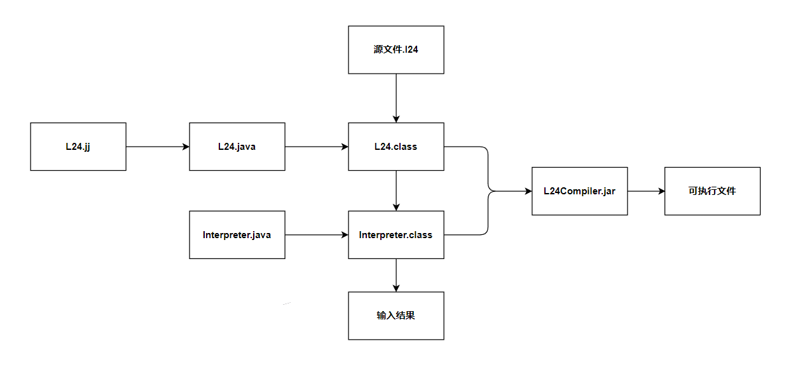
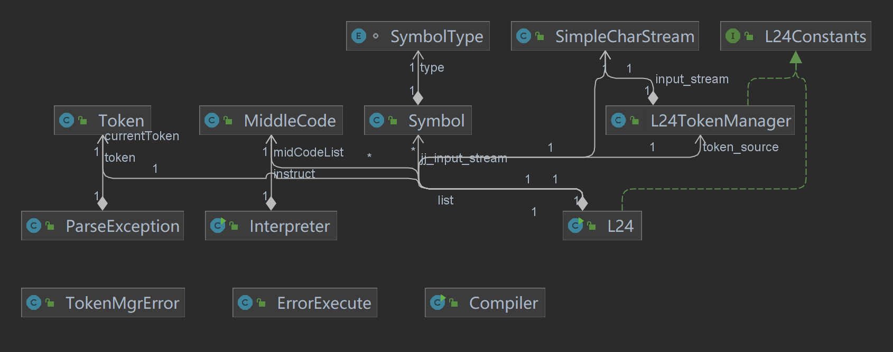

# L24编译器设计说明

## 1.简介

本编译器使用JavaCC自动工具，基于Java语言编程，实现L24语言编译器的词法分析、语法分析、出错处理、代码生成和解释程序。

## 2.编译器设计和运行方式

### 2.1 L24语法描述

扩展点：

1）增加变量声明语句，要求所有变量需要先声明后使用

~~~
<program> := [<definition>]  <main>
<definition> := "var" <ident> {"," <ident>} ";"
<main> := "main" "{" <stmt_list> "}"
<stmt_list> := {<stmt> ";"}
<stmt> := <assign_stmt>|<if_stmt>|<while_stmt>|<scan_stmt>|<print_stmt>
<assign_stimt> := <ident> "=" <expr> 
<if_stmt> := "if" "(" <bool_expr> ")" "then" "{" <stmt _list> "}" ["else" "{" <stmt_list> "}"] "end"
<while_ stmt> := "while" "(" <bool_expr> ")" "{" <stmt _list> "}"
<scan_stmt> := "scan" "(" <ident> {"," <ident>} ")"
<print_stmt> := "print" "(" <expr> {"," <expr>} ")"
<bool_expr> := <expr> ("=="|"!="|"<"|"<="|">"|">=") <expr>
<expr> := ["+"|"-"] <term> {("+"|"-")<term>}
<term> := <factor>{("*"|"")<factor>}
<factor> := <ident>|<number>|"("<expr>"}"
~~~

### 2.2 JavaCC

使用`JavaCC`的`SKIP` 来过滤词法分析部分的空字符

~~~java
SKIP:
{
    " " | "\t" | "\n" | "\r"
}
~~~

使用`TOKEN`定义运算符, 保留字, 标识符 例如

~~~java
//定义保留字
TOKEN : {
    <IF:"if">
|   <ELSE:"else">
|   <THEN:"then">
|   <WHILE:"while">
|   <END:"end">
|   <MAIN:"main">
|   <SCAN:"scan">
|   <PRINT:"print">
|   <VAR:"var">
}
~~~

获取一个`TOKEN`的原文本, 访问其`image`变量

~~~To
Token t = <ident>
String s = t.image
~~~

使用`JavaCC`进行语法分析的同时进行语义分析生成中间代码

### 2.3 代码结构

程序总体结构

项目结构图

类定义

| 类名             | 描述                                                         |
| ---------------- | ------------------------------------------------------------ |
| Symbol           | 定义符号表结构                                               |
| MiddleCode       | 定义中间代码结构                                             |
| L24              | 语法分析器。其中Adder中的方法来源于写在PARSER_BEGIN和PARSER_END中的部分，语法结构部分的方法和JavaCC中的方法。根据`L24.jj`由`JavaCC`自动生成 |
| ParseException   | 语法异常类，实现Exception接口;`JavaCC`自动生成               |
| Token            | 单词定义类;`JavaCC`自动生成                                  |
| TokenMgrError    | 单词错误类;`JavaCC`自动生成                                  |
| SimpleCharStream | 辅助类，用于输入字符串。可以接受InputStream类型和Reader类型的输入流;`JavaCC`自动生成 |
| L24TokenManager  | 含常量的辅助性接口;`JavaCC`自动生成                          |
| L24Constants     | 含常量的辅助性接口;`JavaCC`自动生成                          |
| Interpreter      | 解释程序类                                                   |
| Compiler         | 主函数入口                                                   |
| ErrorExecute     | 自定义错误错类                                               |

静态变量

| 变量名                            | 描述                    |
| --------------------------------- | ----------------------- |
| list                              | 符号表                  |
| ArrayList<MiddleCode> midCodeList | 中间代码表,存储中间代码 |

函数定义

| 函数                               | 描述                    | 参数描述                                           |
| ---------------------------------- | ----------------------- | -------------------------------------------------- |
| addSymbol(Token t)                 | 添加识别的Token到符号表 | Token:识别到的词法                                 |
| askForSpace()                      | 请求数据空间            | null                                               |
| getVariableById(Token t, int type) | 获取变量的值或赋值      | Token同上, type为1存变量值到符号表,type为0取变量值 |

### 2.4 出错处理

#### 自定义错误

| 错误号 | 错误原因           |
| ------ | ------------------ |
| 0      | 变量未声明         |
| 1      | 变量重复声明       |
| 2      | 乘法结果超过上限   |
| 3      | 加法结果超过上限   |
| 4      | 除数为0            |
| 5      | 变量溢出           |
| 6      | 符号表溢出         |
| 7      | 找不到目标文件错误 |
| 8      | 输入类型错误       |

#### JavaCC错误定义

`TokenMgrError`类:词法分析错误

| 错误码 | 错误码               |
| ------ | -------------------- |
| 0      | 非法符号或不符合词法 |

`ParseException`类:语法分析异常

常见错误如下

| 错误码 | 错误原因                                 |
| ------ | ---------------------------------------- |
| 0      | 应为分号                                 |
| 1      | scan缺少标识符                           |
| 2      | print缺少变量                            |
| 3      | 缺少“end”关键字                          |
| 4      | 条件判断中出现不合法的类型               |
| 5      | 应为右小括号’)’                          |
| 6      | "else"关键字前面必须有"if"关键字进行配对 |

## 3.测试结果

### 测试样例1:计算阶乘

~~~
var a,b;
main{
    scan(a);
    b=1;
    while(a!=0){
    b=a*b;
    a=a-1;
    };
    print(b);
}
~~~

### 测试样例2:比较大小,输出差值

~~~
var a,b;
main{
    scan(a,b);
    if(a>b)
    then{print(a-b);}
    else{print(b-a);}
    end;
}
~~~

### 测试样例3:求最大公约数

~~~
var a,b,tmp;
main{
    scan(a,b);
    if(a<b)then{
        tmp=a;
        a=b;
        b=tmp;
    }end;
    while(b!=0)
    {
        tmp=a-a/b*b ;
        a=b;
        b=tmp;
    };
    print(a);
}
~~~

